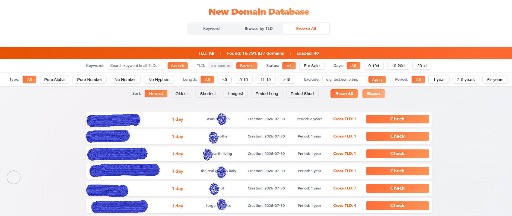

# Newly Registered Domains

More than 200,000 domains are registered every day across 1,000+ gTLDs. Whoever sees them first has the advantage: brand owners spot lookalikes before they go live, security teams catch phishing infrastructure at hour zero, SEO professionals and investors find valuable names before anyone else bids.

[DomainKits](https://domainkits.com) tracks these registrations daily and delivers them in four forms for four kinds of users: a search for people with a question, downloadable files for people with a pipeline, an intelligence view for people watching trends, and an API for people who automate.

## Search newly registered domains

**[domainkits.com/search/new](https://domainkits.com/search/new)**

The fastest way to find newly registered domains matching what you care about. Type a keyword and get every matching domain registered in the last 60 days, from a rolling database of 12 million+ names.

What you can narrow by:

| Filter | What it answers |
|---|---|
| Days since registration | Only what appeared in the last 10 days, or 20+ |
| TLD | One extension or all 1,000+ |
| Keyword position | Names that start with your term, or end with it |
| Registration period | Multi-year registrations signal long-term intent |
| Character type | Pure alpha, pure number, no hyphens, no digits |
| Length | Under 5 characters up to 15+ |
| For-sale status | Which of the new names are already listed |

Each result shows the registration date, days since registration, registration term, and how many other TLDs the same name is registered under. That last field is a quick signal on its own: a name registered across five extensions on the same day is a campaign, not a coincidence.

Use it when you have a specific question: has anyone registered a name containing my brand this week? What did the market register around a trending keyword?

## Newly registered domains database

**[domainkits.com/download/nrds](https://domainkits.com/download/nrds)**

A daily newly registered domains list you can download and process in your own pipeline. Files are organised by TLD and by date, covering 200,000+ new domains per day across 1,000+ extensions, with 30 days of history available.

What you get:

- One file per TLD per day, so you can pull only the extensions you monitor
- Popular extensions at full depth: a typical day carries over 137,000 new .com registrations alone
- Downloads are free for members, with higher tiers unlocking more volume
- The data contains domain names and registration dates only. No registrant personal data is included, which keeps the files GDPR compliant and safe to load into any system

Use it when your analysis lives elsewhere: feeding a SIEM, enriching an internal watchlist, training a model, or building your own scoring on top of a complete newly registered domains database.

## Newly registered domains intelligence

**[domainkits.com/intelligence/nrds](https://domainkits.com/intelligence/nrds)**

The aggregate view: what today's registrations say as a whole. Instead of individual names, this page reads the day's 280,000 registrations as a signal and answers four questions:

1. **What is emerging?** Keywords that appeared today with no previous baseline, ranked by volume. New product names, breaking events and fresh scam themes show up here first.
2. **What is hot?** High-volume keywords with their 7-day average, days on the list, and marketplace listing rates, so you can tell genuine demand from bulk resale campaigns.
3. **Are risk terms spiking?** A fixed watchlist of phishing-adjacent terms (login, verify, wallet, secure and similar) is tracked every day regardless of volume.
4. **Which TLDs are moving?** Extension-by-extension daily volume against the 7-day pace, showing where registration activity is accelerating.

Use it when you want context before detail: whether a keyword you are watching is trending up, whether a spike is organic or a bulk campaign, and which extensions the market is favouring this week.

## Newly registered domains API and SDK

**[domainkits.com/dev](https://domainkits.com/dev)**

Everything above is also available programmatically, with one API key covering every endpoint. Pick the surface that fits your stack:

- **REST API**: query newly registered domains with the same filters as the search page, plus WHOIS, DNS and bulk lookups. See the [API reference](https://domainkits.com/dev/api-docs)
- **TypeScript SDK**: [`@domainkits/sdk`](https://www.npmjs.com/package/@domainkits/sdk) on npm, with typed parameters and automatic paging
- **n8n node**: [`n8n-nodes-domainkits`](https://www.npmjs.com/package/n8n-nodes-domainkits) puts the same queries in your workflows, usable by n8n AI Agents as a tool. A ready-made template shows the pattern: [daily keyword-based domain registration alerts via email](https://n8n.io/workflows/17578-send-daily-keyword-based-domain-registration-alerts-with-domainkits-via-email/)
- **MCP server**: [`@domainkits/mcp`](https://www.npmjs.com/package/@domainkits/mcp) connects Claude, Cursor and other AI assistants directly to the data. Pair it with [DomainKits Skills](https://github.com/ABTdomain/domainkits-skills), open-source workflow prompts for domain research tasks

Use it when the question repeats: a daily brand check, a registration feed into your pipeline, or an AI agent that needs live domain data.

## From open to open

Domain registrations are public records, and DomainKits keeps them that way. The data comes from public sources and leaves as open data: no registrant personal information anywhere in the pipeline (no names, emails, addresses or phone numbers), and downloads free for members. The output is GDPR compliant, so anything you pull here can be stored, shared and loaded into your systems without handling personal data.

## Which one do you need

| You want to | Go to |
|---|---|
| Look up names matching a keyword right now | [Search](https://domainkits.com/search/new) |
| Pull daily files into your own tooling | [Database](https://domainkits.com/download/nrds) |
| Read the day's registration trends | [Intelligence](https://domainkits.com/intelligence/nrds) |
| Automate any of the above | [API and SDK](https://domainkits.com/dev) |

The three share the same daily data, so a keyword you spot in the intelligence view can be expanded in search, and the full list behind both is downloadable.

## Who uses this

- **Brand protection**: find newly registered domains containing a brand name while they are hours old, before they carry content. The [brand protection skill](https://github.com/ABTdomain/domainkits-skills/tree/main/skills/brand-protection) turns this into a guided scan any AI assistant can run
- **Security research**: new registrations are the raw material of phishing. The watchlist and daily files support detection at registration time, not at first report
- **SEO and domain investing**: spot valuable names and rising keywords inside the registration stream before they surface on marketplaces
- **Market research**: registration volume by keyword and TLD is a leading indicator of where attention is moving

## FAQ

**How many domains are registered every day?**
Typically 200,000 to 300,000 across gTLDs, with .com accounting for roughly two thirds. The [intelligence page](https://domainkits.com/intelligence/nrds) shows the exact daily count.

**How do I find newly registered domains for a specific keyword?**
Use the [search page](https://domainkits.com/search/new). It covers a rolling 60-day window and filters by TLD, length, position and character type.

**Can I download a complete newly registered domains list?**
Yes. The [download page](https://domainkits.com/download/nrds) publishes daily files per TLD, free for members, with 30 days of history.

**Does the data include ccTLDs?**
No. Coverage is 1,000+ generic TLDs. Country-code extensions are not included.

**Is there an API?**
Yes, the same data is available programmatically. See the [API documentation](https://domainkits.com/dev/api-docs).
